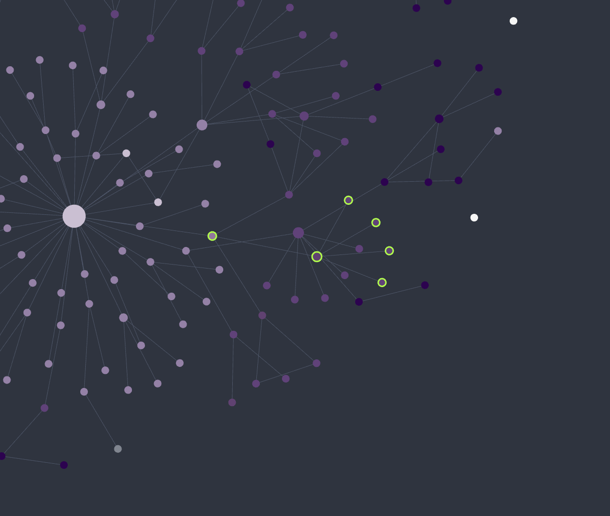

# Graph Unread Highlight

An Obsidian plugin that marks **new or recently edited notes** in the **graph view** with a highlight ring, and gives you a one-click **"mark all as read."** Built for **AI-assisted workflows** — when an AI assistant or automated tool writes and edits notes for you, the rings show at a glance which notes it touched since you last looked.

## Why this plugin exists

When *you* pick a note and edit it yourself, you already know exactly what changed — so highlighting it adds nothing.

This plugin is built for the opposite case: when an **AI assistant or other automated tool writes and edits notes for you**. In that workflow it's easy to lose track of which notes were just created or rewritten on your behalf. The graph view then becomes a quick overview of *what the tool touched* — the rings show you, at a glance, every note that was added or changed since you last looked, so you can review them and mark them as read once you've caught up.

## How it decides what's "unread"

The plugin keeps a small per-note record of when you last *saw* each note (a `path → timestamp` map in the plugin's own `data.json`). A note counts as **unread** when:

- it has **never been seen**, or
- its file's **last-modified time (`mtime`) is newer than the last time you saw it** — i.e. it was edited since.

A note becomes **read** (its "seen" time is set to now) when:

- you **open** it, or
- you run **Mark all as read** (sets every note to read at once).

So newly created notes and notes edited since you last opened them get a ring; opening a note clears its ring; the button clears them all. Your notes are never modified — only a timestamp map in the plugin's data file is updated.

## How the highlight is drawn

The ring is drawn **on the graph canvas itself** (a marker added to the renderer's node layer), so it automatically tracks each node as you pan, zoom, or as the simulation moves nodes. It is a **hollow ring sized to each node**, which means:

- it never covers small nodes — the node shows through the ring;
- it **does not change node colors**, so your theme and **Graph color groups stay intact** (and it won't fight color-based graph plugins, which can only set one color per node).

Works in both the global **Graph view** and the **Local graph**.

## Settings

- **Badge color** — color of the unread ring (color palette). Default: a vivid magenta, chosen to stand out from common node colors.
- **Ring gap** — how far the ring sits outside the node.
- **Mark all as read** — clear every ring now (also available from the command palette).

## Notes

This plugin reads file modification times and draws into the graph view's internal renderer (PIXI). It relies on internal renderer APIs that are not part of the public plugin API and may change in future Obsidian versions. It is desktop-only.

## License

[MIT](LICENSE)
